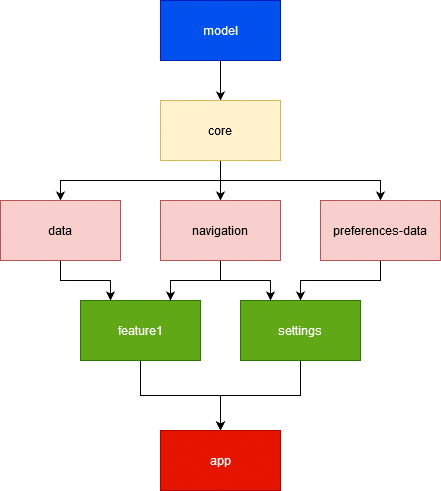

## Android Template

[](https://github.com/Insiderser/AndroidTemplate/actions?query=branch%3Amaster+workflow%3Abuild)
[](https://www.codacy.com/manual/Insiderser/AndroidTemplate?utm_source=github.com&amp;utm_medium=referral&amp;utm_content=Insiderser/AndroidTemplate&amp;utm_campaign=Badge_Grade)

This is the project that contains all the common
logic that I use (or plan to use) to build Android apps.

This template includes:

- boilerplate code that we do in most Android apps nowadays
- multi-module setup with reusable build logic in [buildSrc](buildSrc/)
- CI configuration with GitHub Actions
- Dagger setup
- settings

### Architecture



The project is multi-module. All feature modules have their own modules.
Notice we have this `navigation` module which (you guessed it) contains
everything needed for navigation between features. Also, we have those
shared modules that share code between different modules.

The architecture was heavily inspired by [this presentation](https://youtu.be/jrnhIgFzgns).

### License

```
MIT License

Copyright 2020 Oleksandr Bezushko

Permission is hereby granted, free of charge, to any person obtaining a copy
of this software and associated documentation files (the "Software"), to deal
in the Software without restriction, including without limitation the rights
to use, copy, modify, merge, publish, distribute, sublicense, and/or sell
copies of the Software, and to permit persons to whom the Software is
furnished to do so, subject to the following conditions:

The above copyright notice and this permission notice shall be included in all
copies or substantial portions of the Software.

THE SOFTWARE IS PROVIDED "AS IS", WITHOUT WARRANTY OF ANY KIND, EXPRESS OR
IMPLIED, INCLUDING BUT NOT LIMITED TO THE WARRANTIES OF MERCHANTABILITY,
FITNESS FOR A PARTICULAR PURPOSE AND NONINFRINGEMENT. IN NO EVENT SHALL THE
AUTHORS OR COPYRIGHT HOLDERS BE LIABLE FOR ANY CLAIM, DAMAGES OR OTHER
LIABILITY, WHETHER IN AN ACTION OF CONTRACT, TORT OR OTHERWISE, ARISING FROM,
OUT OF OR IN CONNECTION WITH THE SOFTWARE OR THE USE OR OTHER DEALINGS IN THE
SOFTWARE.
```
